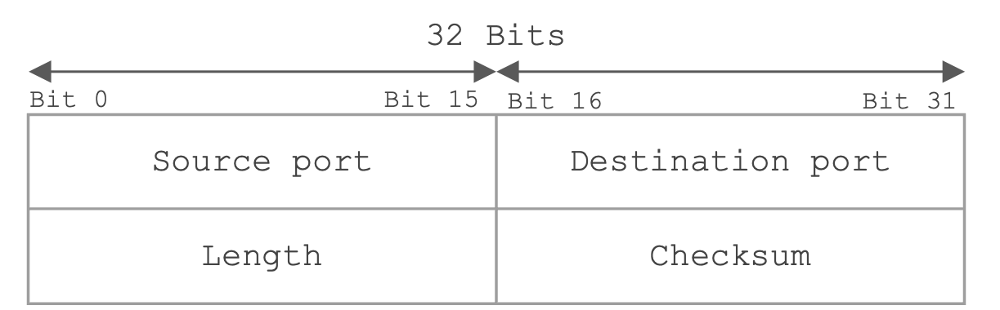
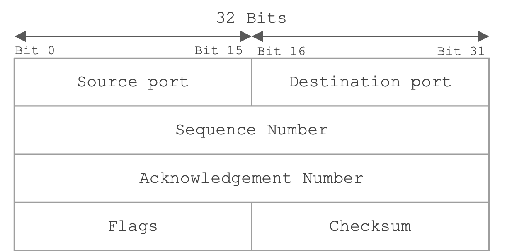
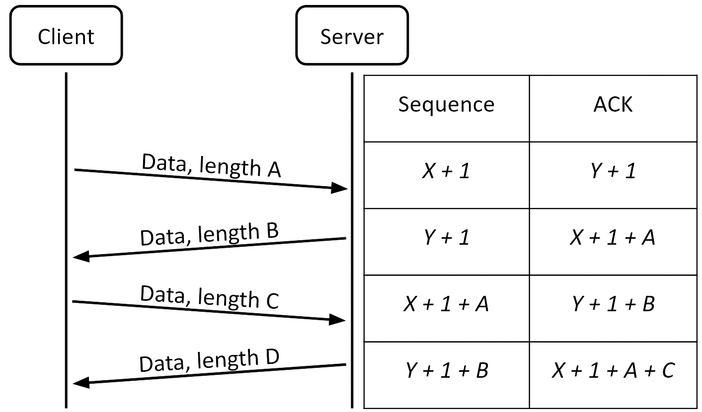
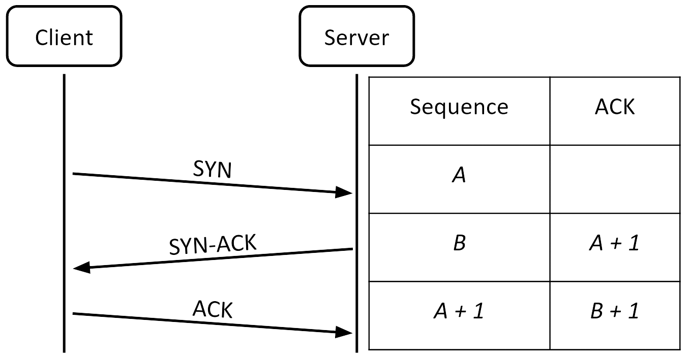

# Transport Layer: TCP, UDP, and Attacks

## Cheat sheet

- **Layer**: Transport (Layer 4)
- **Purpose**:

  - Allow communication between specific processes on different machines using ports
  - TCP provides reliable, ordered, connection-oriented byte stream delivery
  - UDP provides simple, unreliable datagram delivery

- **Key Vulnerability**:

  - TCP has no built-in authentication or integrity protection.
  - On-path and in-path attackers can inject data or RST packets into an existing connection.
  - Off-path attackers can inject packets if they correctly guess the 32-bit sequence number.

- **Major Attack**:

  - RST Injection — An attacker sends a forged packet with the RST flag set to abruptly terminate a TCP connection.
  - TCP Session Hijacking — An attacker injects data into an established session to exploit IP-based credibility.
  - SYN Flood — An attacker exhausts server resources by initiating, but never completing, TCP handshakes.

- **Defenses**:
  - Use TLS on top of TCP to provide confidentiality and integrity.
  - Use random, unpredictable initial sequence numbers to make off-path attacks much harder.
  - Use SYN Cookies to defend against SYN flood attacks.

---

## Networking Background: Ports

The Internet Protocol (IP) is responsible for delivering packets from one machine to another across the network. However, IP is fundamentally a best-effort protocol. It makes no guarantees that packets will be delivered, that they will arrive in the correct order, or that they will not be corrupted or duplicated during transmission. These limitations are by design. IP prioritizes simplicity and scalability over reliability.

In addition to its best-effort nature, IP has another important limitation: an IP address identifies a machine, not a specific process running on that machine. In reality, modern computers typically run many applications and services at the same time. A user might have a web browser with multiple tabs open, an email client, a video conferencing application, an SSH session, and background services all active simultaneously. When a packet arrives at a machine, the operating system must determine which of these processes should receive it. IP alone provides no mechanism to make this distinction.

To solve this problem, the transport layer introduces port numbers. A port number is a 16-bit value that acts as an identifier for a specific process on a machine. When combined with an IP address, a port number allows the operating system to correctly deliver incoming packets to the right application. In this way, multiple processes on the same machine can send and receive network traffic independently without interfering with one another.

Port numbers are generally divided into two categories. _Well-known ports_ (typically numbers from 0 to 1023) are reserved for standard services and protocols. For example, web servers usually listen for HTTP traffic on port 80 and for HTTPS traffic on port 443. Because these ports are associated with critical system services, only programs running with root or administrator privileges can receive packets at those ports, but anyone can send packets to those ports. On the other hand, client applications typically use _ephemeral ports_ which are temporary port numbers that are randomly assigned by the operating system when a connection is established. This allows a system to make several connections to the same server at the same time, each using a different ephemeral port.

## The User Datagram Protocol (UDP)

The **User Datagram Protocol (UDP)** is a simple transport layer protocol that provides best-effort delivery of data between processes. It sits directly above IP and adds very little functionality on top of it. Like IP, UDP does not guarantee that packets will be delivered, that they will arrive in order, or that they will not be duplicated. If an application needs reliability, it must implement that functionality itself or use a different protocol such as TCP.

UDP is a datagram-oriented protocol. This means that applications send and receive data in discrete, self-contained units called datagrams. It is possible for datagrams to be larger than the underlying network's packet size, but this can sometimes introduce problems. Each UDP datagram is treated independently from all others. There is no connection establishment phase, no connection state maintained between the sender and receiver, and no mechanism to ensure that datagrams arrive at their destination. If a datagram is lost in the network, UDP does not retransmit it. If datagrams arrive out of order, UDP delivers them to the application in the order they were received.

Because UDP adds so little overhead, it is very lightweight and efficient. The UDP header is only 8 bytes long and contains just four fields: a 16-bit source port, a 16-bit destination port, a 16-bit length field, and a 16-bit checksum. The port numbers allow the operating system to deliver incoming datagrams to the correct process. The checksum provides a basic (non-cryptographic) way to detect corrupted datagrams, although its use is optional in IPv4 (it is mandatory in IPv6).

Despite its lack of reliability guarantees, UDP is widely used in situations where speed and low latency are more important than guaranteed delivery. For example, the Domain Name System (DNS) typically uses UDP because DNS queries are usually small and need to be answered very quickly. Real-time applications such as voice over IP (VoIP), video conferencing, and online games also often prefer UDP. In these cases, it is usually better to occasionally lose a packet than to wait for retransmissions, which would introduce unacceptable delays.

From a security perspective, UDP offers even fewer protections than TCP (which we will explore in the next section). Because there is no connection state or handshake, it is relatively easy for an attacker to spoof UDP datagrams. Additionally, UDP provides no built-in protection against packet injection or modification. As with TCP, any security guarantees must be provided by protocols running above UDP, such as DTLS (which you can think of as simply the UDP-equivalent of TLS) or other application-layer encryption and authentication mechanisms.

## The Transmission Control Protocol (TCP)

The **Transmission Control Protocol (TCP)** is the most widely used transport layer protocol on the Internet. Unlike UDP, TCP provides reliable, ordered, and connection-oriented delivery of data between processes. It ensures that data sent from one application arrives at the destination application correctly, completely, and in the proper sequence, even when the underlying IP network loses, reorders, or duplicates packets.

TCP achieves this reliability by maintaining connection state between the two communicating endpoints and by using several mechanisms such as sequence numbers, acknowledgments, retransmissions, and flow control. Because of these features, programmers can treat TCP as a reliable, bi-directional byte stream. They can send and receive arbitrary amounts of data without worrying about the underlying packet boundaries or network unreliability.

### TCP Header and Connection Identification

Like UDP, the TCP header includes 16-bit source and destination port numbers, which allow the operating system to deliver data to the correct process. It also contains a checksum for basic error detection. However, the TCP header is significantly more complex because it must support reliability and connection management.

In addition to the port numbers and checksum, the TCP header contains a 32-bit _sequence number_ and a 32-bit _acknowledgment number_. These fields are fundamental to TCP’s ability to track which data has been sent and received. The header also includes several control flags (such as SYN, ACK, FIN, and RST) that are used to manage the state of the connection.

A TCP connection is uniquely identified by a _5-tuple_: the client’s IP address and port, the server’s IP address and port, and the protocol (TCP). This 5-tuple allows multiple independent TCP connections to exist simultaneously between the same pair of machines.

### Byte Streams and Sequence Numbers

TCP provides two independent byte streams between the client and the server, one in each direction. Each stream is treated as a continuous sequence of bytes, and TCP uses sequence numbers to keep track of the position of data within each stream.

In every TCP segment, the sequence number indicates the position of the first byte of data carried in that segment within the sender’s byte stream. If packets arrive out of order, the receiving side can use the sequence numbers to reassemble the data correctly before delivering it to the application.

### Acknowledgments and Reliability

To ensure reliable delivery, TCP uses _acknowledgments_. When a receiver successfully receives data, it sends back an acknowledgment (ACK). The acknowledgment (ACK) number in the header is set to the index of the last byte received, plus 1 (i.e., the sequence number of the next expected byte). As a general rule: in each packet, the sequence number is an index in the sender's bytestream, and the ACK number is an index in the recipient's bytestream. If the sender does not receive an acknowledgment within a certain timeout period, it retransmits the data.

TCP also uses a technique called _cumulative acknowledgment_, where a single ACK can confirm the receipt of multiple segments at once. Furthermore, TCP combines acknowledgments with data whenever possible, so that ACKs do not always require separate packets. This improves efficiency, especially during two-way communication.

### Connection Establishment: The Three-Way Handshake

Before any data can be exchanged, TCP requires the client and server to establish a connection through a process known as the **three-way handshake**. This handshake serves two important purposes: it synchronizes the initial sequence numbers between both sides and confirms that both parties are ready to communicate.

The handshake works as follows:

1. The client sends a _SYN_ segment to the server, containing a randomly chosen 32-bit _initial sequence number (ISN)_.
2. If the server is willing to accept the connection, it replies with a _SYN-ACK_ segment. This segment contains the server’s own randomly chosen initial sequence number and acknowledges the client’s ISN by setting the acknowledgment number to ISN + 1.
3. The client completes the handshake by sending an _ACK_ segment that acknowledges the server’s initial sequence number.

The use of random initial sequence numbers is important for security, as it makes it significantly harder for off-path attackers to guess valid sequence numbers and inject packets into an existing connection.

### Flow Control and the Receive Window

Once a connection is established, TCP must manage the flow of data to handle the chaotic nature of the Internet. To do this, TCP uses a **Receive Window** (often called a sliding window). This window represents the amount of available buffer space the receiver has to temporarily store incoming data.

Because packets routed across the network frequently arrive out of order, the receiver does not strictly drop packets that arrive early. Instead, the operating system is designed to be forgiving: it will accept and buffer any packet whose sequence number falls anywhere within this currently open window. It simply holds onto these out-of-order packets until the missing pieces arrive, reassembles the stream in the correct order, and then passes the complete data to the application layer.

### Connection Termination

TCP connections can be closed gracefully or aborted abruptly. To close a connection gracefully, one side sends a segment with the **FIN** flag set. The other side acknowledges the FIN and may continue sending data in the opposite direction (this is called a “half-close”). When the second side is also finished, it sends its own FIN, which is acknowledged. Because both sides must independently close their half of the connection, this graceful closure process is known as the four-way teardown (FIN, ACK, FIN, ACK), ensuring the connection is fully terminated without data loss.

TCP also supports abrupt termination through the **RST** (reset) flag. A RST packet tells the other side that the sender will not send or accept any more data on this connection. Unlike FIN packets, RST packets are not acknowledged. RSTs are typically used when something goes wrong, for example, when a program crashes or when a segment arrives that does not belong to any known connection.

## Tradeoffs Between TCP and UDP

TCP and UDP represent two fundamentally different approaches to transport layer communication, and each comes with its own set of tradeoffs. The choice between them depends on the specific requirements of the application, particularly regarding reliability, latency, and complexity.

TCP provides strong guarantees: it ensures that data is delivered reliably, in order, and without duplication. However, these guarantees come at a cost. Establishing a TCP connection requires a three-way handshake, which adds latency before any data can be sent. Furthermore, TCP’s reliability mechanisms such as acknowledgments, retransmissions, and congestion control, introduce additional overhead. As a result, TCP is generally slower and has higher latency compared to UDP. Applications that require strict correctness and ordered delivery, such as web browsing, email, file transfers, and most web services, benefit from these guarantees and are therefore well-suited to TCP.

UDP, on the other hand, offers minimal services on top of IP. It provides no connection establishment, no reliability, and no ordering guarantees. This simplicity makes UDP very lightweight and efficient. Because there is no handshake or retransmission mechanism, UDP can achieve lower latency and higher throughput in many scenarios. Applications that are sensitive to delay and can tolerate occasional packet loss often prefer UDP. Common examples include DNS queries, real-time voice and video communication (such as VoIP and video conferencing), and online multiplayer games. In these cases, it is usually better to occasionally lose a packet than to wait for retransmissions, which would cause noticeable delays or stuttering.

From a security perspective, the differences between TCP and UDP also have implications. TCP’s connection-oriented nature and sequence numbers make certain attacks (such as blind packet injection) more difficult, especially when random initial sequence numbers are used. UDP, with its connectionless nature, is generally easier to spoof and is more susceptible to amplification attacks (such as DNS amplification) which we will cover later. However, neither protocol provides confidentiality or strong integrity protection on its own. In both cases, applications that require security must rely on higher-layer protocols such as TLS or DTLS.

## Vulnerabilities and Attacks on TCP

### The Inherent Insecurity of TCP

TCP was designed in an era when the Internet was much smaller and most participants were assumed to be cooperative. As a result, the protocol provides _no built-in authentication_ or _integrity protection_. TCP ensures reliable delivery between two endpoints, but it does not verify that the sender of a segment is who they claim to be, nor does it protect the contents of a segment from being read or modified by an attacker.

Because TCP lacks these security properties, the fundamental design of the protocol itself is vulnerable to interference. An attacker who can craft a TCP segment that appears valid to the receiver can interfere with an existing connection. These attacks do not require breaking encryption or guessing passwords. Instead, they rely entirely on an attacker's position in the network. In the following sections, we will examine how different types of attackers can exploit this lack of authentication to execute two primary types of attacks: TCP Packet Injection (inserting malicious data into an ongoing stream) and RST Injection (forcing a connection to terminate prematurely).

### TCP Packet Injection

Because TCP inherently trusts the network, the most direct exploitation of that trust is **TCP Packet Injection**. In this attack, an adversary crafts a forged TCP segment and sneaks it into an active, ongoing connection between a legitimate client and server.

Remember that TCP has no cryptographic authentication to verify who actually sent a packet. Instead, the receiver evaluates an incoming segment based purely on its header fields, in particular the IP addresses, port numbers, and sequence numbers. If an attacker can accurately spoof these values, the receiver will be tricked into blindly accepting the malicious segment as the next valid piece of the byte stream.

When an attacker successfully inserts their own data into the stream, it is known as **TCP Session Hijacking**. The attacker effectively takes over the conversation. Because the server processes the injected data under the assumption that it came from the trusted client, the attacker immediately inherits the legitimate client's trust level. This allows the adversary to effortlessly bypass IP-based firewalls, exploit IP whitelists, or execute malicious commands while framing the innocent user.

However, to craft a segment that the receiver will actually consider valid, the attacker must perfectly match the active state of the connection. While discovering the correct IP addresses and port numbers is often trivial, the true hurdle is the sequence number. If the sequence number in the injected segment is outside the range the receiver currently expects, the segment will typically be discarded.

We can analyze this attack based on the three types of network adversaries:

**Off-path Adversary**  
An off-path attacker cannot observe the traffic between the two legitimate parties. To successfully inject a packet, they must correctly guess or know the full 5-tuple (source IP/port, destination IP/port, and protocol) as well as a valid sequence number. The server’s IP address and port are typically public. The client's ephemeral port is also relatively easy to guess. Although ports are 16-bit numbers, they were never designed to be cryptographically secure secrets. Many operating systems assign client ports sequentially or from predictable, limited ranges, allowing an attacker to easily narrow down or brute-force the correct value.
Because the sequence number space is 32 bits, guessing a specific sequence number has a probability of exactly $1/2^{32}$ (approximately 1 in 4 billion). However, as we discussed earlier, TCP receivers do not require an exact match. They will blindly accept any sequence number that falls within their currently open _Receive Window_ (denoted as $W$). Because of this sliding window, an off-path attacker does not necessarily need 4 billion attempts. Instead, they only need roughly $\frac{2^{32}}{W}$ total guesses to successfully land a packet inside the accepted range. While a larger window size theoretically lowers the difficulty for the attacker, blind injection still remains highly impractical against modern TCP implementations as long as the initial sequence numbers are properly randomized.

**On-path Adversary**  
An on-path attacker sits somewhere along the path between the client and server and can observe the traffic. Because they can see the sequence numbers, acknowledgment numbers, and port numbers in real time, they do not need to guess any values. They can easily craft and inject segments that will be accepted by the receiver. For example, after observing a legitimate packet, the attacker can immediately send their own segment with the correct sequence and acknowledgment numbers, potentially racing against the real sender.

**In-path Adversary (Man-in-the-Middle)**  
An in-path attacker has all the capabilities of an on-path attacker and can additionally modify or block traffic. This makes injection even easier, as the attacker can prevent the legitimate packet from reaching the receiver and replace it with their own. They do not need to race the original sender because they can suppress the original packet entirely.

It is worth noting that clumsy data injection attempts can trigger a network anomaly known as an **ACK Storm**. If an attacker injects data that causes the legitimate client and server sequence numbers to fall out of sync, the two endpoints will continuously send ACK packets back and forth, each trying to correct the other's expected sequence numbers. This feedback loop continues until a packet is dropped due to network congestion, temporarily creating a localized denial-of-service condition.

While inserting data allows an attacker to hijack an ongoing session, sometimes the adversary's goal is simply to disrupt and destroy the communication entirely. To achieve this, attackers pivot away from complex data injection and instead use a highly effective technique known as **RST Injection**.

### RST Injection Attacks and Real-World Use

A particularly simple yet powerful attack against TCP is **RST injection**. In this attack, the adversary sends a single forged TCP segment with the **RST** (reset) flag set. When a TCP endpoint receives a valid RST segment, it assumes a fatal error has occurred and immediately terminates the connection without sending any further data or acknowledgments. The other party receives a “Connection reset by peer” error, and the communication is abruptly closed.
Unlike data injection, which requires the attacker to maintain correct sequence numbers over an ongoing stream, a single well-crafted RST packet is often enough to destroy a connection. For the attack to succeed, the RST segment simply needs a sequence number that falls anywhere within the receiver’s current _Receive Window_.

RST injection is a particularly attractive attack for several reasons.
First, it is extremely low cost. An attacker needs to send only a single packet to terminate a connection, and they do not need to maintain any state or continue interacting with the target after the reset is sent.

Second, the attack is easy to carry out against services that use well-known ports. Because many important services (such as HTTP on port 80 and HTTPS on port 443) listen on predictable ports, an attacker often only needs to know the IP address of one of the parties to launch the attack. This makes high-profile services and censored destinations relatively easy targets.

Third, RST packets are a normal part of TCP operation. When a connection is terminated due to an error or a crashed process, a legitimate RST may be sent. This makes it difficult for the endpoints to distinguish between a genuine reset and a forged one without additional context or cryptographic protection. As a result, most operating systems and applications will immediately close the connection upon receiving a valid RST, giving the attacker a high success rate.

Finally, because the attack can be performed by any on-path or in-path observer, it can be deployed by network operators, malicious insiders, or sophisticated adversaries who control part of the network infrastructure. These characteristics have made RST injection a practical tool for both censorship and traffic management in the real world.

#### Real-World Examples of RST Injection

RST injection has been used in practice by both governments and internet service providers.

One of the most well-documented examples is the _Great Firewall of China_. The Chinese government uses RST injection as part of its internet censorship system. When a user inside China attempts to access a website or content that is blocked, network devices inspect the traffic. If a forbidden keyword is detected in a TCP connection (for example, in an HTTP request), the firewall sends forged RST packets to both the client and the server. This causes both sides to immediately terminate the connection. Interestingly, the original request often continues to reach the destination, but the connection is reset before the full response can be delivered. Research has shown that simply ignoring these forged RST packets can allow users to bypass the censorship in many cases.

Another notable example occurred in the United States. In 2007, it was discovered that _Comcast_ was using RST injection to disrupt BitTorrent traffic. When Comcast detected that a customer was uploading data using the BitTorrent protocol, it injected RST packets into the connection, causing the upload to fail. This technique was more aggressive than simple traffic throttling because it actively terminated connections rather than just slowing them down. The practice led to significant public backlash and was later ruled to violate net neutrality principles by the Federal Communications Commission (FCC).

#### Forensic Detection

Despite its effectiveness, RST injection often leaves forensic evidence. Because the forged RST packet is generated by a third-party attacker (like a network middlebox or censor) rather than the actual client or server, it is incredibly difficult for the attacker to perfectly mimic the internal state of the victim's operating system.
Security researchers can often detect forged resets by looking for anomalies, such as unexpected Time-To-Live (TTL) values, strange IP Identification (IPID) numbers, or sequence numbers that increment in highly specific, unnatural patterns (e.g., exactly +1460 bytes). By analyzing these fingerprints, analysts can detect that a connection was maliciously terminated, and often identify the specific censorship infrastructure used to execute the attack.

#### Summary: Attacker Positioning and Threat Models

As we have seen with both data injection and forged resets, the difficulty of exploiting TCP varies significantly depending on the adversary's position in the network. The table below summarizes the capabilities of the three types of adversaries we explored:

| Attacker Type      | Can observe traffic? | Can inject data? | Can perform RST Injection? | Difficulty of Attack |
| ------------------ | -------------------- | ---------------- | -------------------------- | -------------------- |
| **Off-path**       | No                   | Difficult        | Difficult                  | High                 |
| **On-path**        | Yes                  | Easy             | Easy                       | Low                  |
| **In-path (MitM)** | Yes                  | Very Easy        | Very Easy                  | Very Low             |

While TCP is reasonably resistant to blind, off-path attacks when properly implemented (due to the mathematical difficulty of guessing sequence numbers), it offers virtually zero protection against attackers who can observe or control the network path.

## Defending Against TCP Injection and Resets

While TCP itself offers very little protection against malicious actors, there are several effective defenses that can significantly reduce the risk of the attacks discussed in the previous section. These defenses operate at different layers and have different strengths and limitations.

#### Sequence Number Randomization

One of the first and most important built-in defenses in modern TCP implementations is the use of _random initial sequence numbers (ISNs)_. When a TCP connection is established, each side chooses a random 32-bit initial sequence number rather than starting from zero or a predictable value. This design makes it mathematically impractical for off-path attackers to successfully guess a sequence number within the valid receive window.

#### Higher-Layer Cryptography (TLS)

The most powerful and widely used defense against TCP attacks is to run a secure protocol on top of TCP. Transport Layer Security (TLS) is the standard solution used by HTTPS, secure email, and many other applications that we will discuss in later topics.

TLS provides three critical properties that TCP inherently lacks:

- _Confidentiality:_ Data is encrypted, preventing eavesdropping.
- _Integrity:_ Any modification or injection by an attacker is immediately detected and rejected.
- _Authentication:_ Digital certificates verify the identities of the communicating parties.

#### Endpoint Mitigations and Challenge ACKs

In addition to TLS and random ISNs, modern operating systems use practical mitigations to harden their TCP stacks against malicious interference.

- _Strict RST Validation:_ Some systems, specifically in response to censorship infrastructure like the Great Firewall of China, can be configured to ignore suspicious RST packets. By waiting for additional confirmation (like a subsequent FIN packet or a timeout) rather than immediately tearing down the connection, endpoints can sometimes successfully bypass forged resets.
- _RFC 5961 (Challenge ACKs):_ Modern TCP implementations use this standard to prevent blind injection. If a system receives an out-of-order RST packet or an unexpected SYN on an established connection, it does not immediately drop the session. Instead, it sends a "Challenge ACK" back to the sender. A legitimate peer will respond correctly, whereas a blind, spoofed packet will fail the challenge and be instantly discarded.

#### Limitations of These Defenses

It is important to be realistic about what these defenses can and cannot achieve.

Random initial sequence numbers are effective only against _off-path_ attackers. They provide no protection once an attacker can observe traffic on the path.

TLS protects the _data_ being transmitted, but it does not prevent an attacker from resetting the underlying TCP connection. An on-path attacker can still cause a denial of service by sending RST packets before or during the TLS handshake.

Furthermore, many legacy systems, internal enterprise applications, and older protocols still do not use TLS. In these environments, TCP attacks remain a realistic threat.

Finally, defenses like ignoring RST packets are not foolproof and can sometimes interfere with legitimate connection termination.

### The SYN Flood Attack

While packet injection and forged resets exploit TCP's lack of authentication, another major class of attacks targets how TCP manages its internal memory. A **SYN Flood** is a classic Denial-of-Service (DoS) attack that exploits the very first step of TCP communication: the three-way handshake.

To understand how it works, imagine a restaurant that takes reservations over the phone. If a prankster calls, books every single table under a fake name, and never shows up, legitimate customers will be turned away because the restaurant believes it is at full capacity. A SYN flood does the exact same thing to a server's memory.

#### The Vulnerability: Half-Open Connections

During a normal TCP handshake, a client sends a _SYN_ packet to request a connection. When the server receives this request, it must allocate memory and operating system resources to keep track of it. The server records the sequence numbers, IP addresses, and ports, and then places this "half-open" connection into a bounded waiting room called the _SYN backlog queue_.

The server then replies with a _SYN-ACK_ and waits for the client's final _ACK_ to complete the handshake and move the connection out of the queue.

#### The Execution

In a SYN flood attack, an adversary abuses this waiting period. The attacker sends a massive volume of malicious SYN packets to the target server. To avoid being traced and to prevent the handshake from accidentally completing, the attacker frequently uses spoofed (fake) source IP addresses.

The server, acting exactly as it was designed to, dutifully allocates memory for every single forged request, adds them to its SYN backlog queue, and sends out SYN-ACKs to the fake addresses. Because the source addresses are fake, the final ACK never returns.

#### The Impact: Resource Exhaustion

As the flood of malicious SYNs continues, the server's SYN backlog quickly fills up with these "ghost" connections. Because the queue has a strict maximum capacity, the server eventually runs out of space. Once the backlog is full, the server cannot process any new connection requests from anyone. It is forced to drop perfectly legitimate traffic, resulting in a successful denial of service.

This attack is incredibly dangerous because it is highly _asymmetric_. It costs the attacker almost zero bandwidth and processing power to generate tiny, raw SYN packets. However, it forces the target server to allocate heavily and exhaust its critical system resources.

### Defense: SYN Cookies

The most effective defense against a SYN flood is a technique known as _SYN Cookies_.
The fundamental vulnerability of standard TCP is that the server allocates state before verifying that the client is fully reachable and legitimate. SYN Cookies solve this by pushing the state storage back onto the client.

When a server using SYN Cookies receives a SYN request, it does not allocate any memory in its queue. Instead, the server takes the connection details (the IP addresses, the ports, and a timestamp) and combines them with a secret key known only to the server to compute a cryptographic hash. The server uses this resulting hash as its _Initial Sequence Number (ISN)_ in the SYN-ACK response it sends back to the client. This special sequence number is the "cookie". Once the SYN-ACK is sent, the server forgets the interaction. If this was a spoofed request from an attacker, the packet simply disappears into the network, and the server has lost absolutely no memory.

If the client is legitimate, it will reply with an ACK that acknowledges this specific sequence number. When the server receives this final ACK, it extracts the cookie and recalculates the hash to verify it. If the recalculated hash matches, the server has mathematical proof that the client successfully received the SYN-ACK and is a legitimate participant. Only if the validation succeeds does the server allocate memory and officially establish the connection. This clever cryptographic trick completely eliminates the threat of state exhaustion from incomplete handshakes, effectively neutralizing the SYN flood attack.
