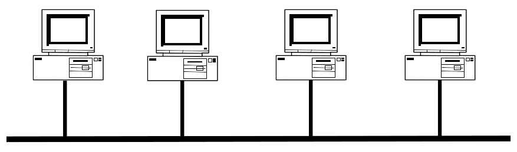
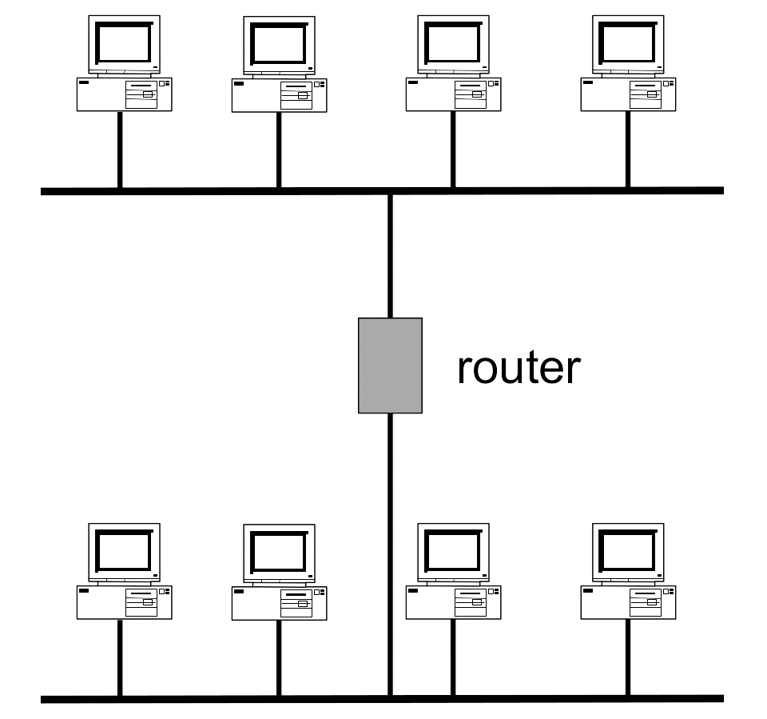
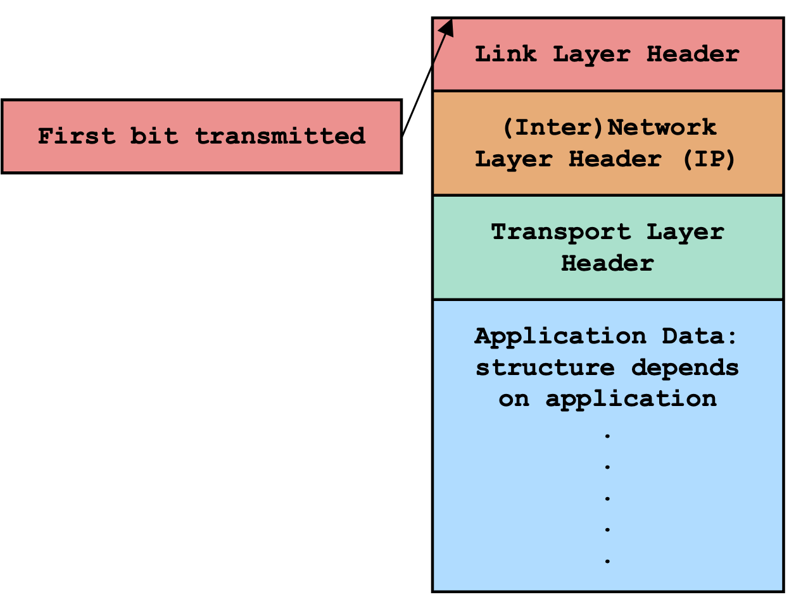

# Introduction to Networking

To effectively secure a network, we must first understand its underlying architecture. This section provides a foundational overview of computer networking principles and the structure of the modern Internet.

## 1. Why Networking Matters in a Security Course

In Unit 1 you learned powerful cryptographic tools that can protect the *confidentiality*, *integrity*, and *authenticity* of data. These tools are essential, but they are not enough on their own.

To see why, consider a simple question: **who can access your computer?**

Most people do **not** have physical access to your laptop, phone, or server. The exceptions are rare. Perhaps a roommate, a family member, or law enforcement with a warrant. In contrast, **literally everyone on the Internet** has *network* access to any device you connect to the global Internet.

Your bank, your car, the database holding your medical records, the power grid, airplanes, and even critical infrastructure are all reachable over the network. An attacker does not need to be in the same room or even the same country. A criminal group in one part of the world, a nation-state actor on another continent, or a curious student down the street can all attempt to reach your systems the moment you are online.

Fortunately, nothing important is connected to the Internet!  … or so we might wish. In reality, almost everything that matters *is* connected.

to facilitate fast and efficient communication across what began as isolated computing grids and clusters, evolving into the interconnected networks we use today. Security was not part of the original design. As a result, these protocols provide:

- **No confidentiality** — anyone who can see the packets can read the data inside.
- **No authentication or integrity protection** — there is no built-in way to verify that a packet really came from the claimed sender or that it has not been altered in transit.

This is the “bottom line” you must remember throughout Unit 2: the Internet works extremely well at delivering bits from one place to another, but it does so with almost no security guarantees. Cryptography can (and will) help, but only if we first understand *how* data actually travels across the network and where the vulnerabilities lie.

That is exactly why we begin with Networking Fundamentals. Once you see how the Internet is built layer by layer, you will understand why so many real-world attacks succeed and what we can do to defend against them.

## 2. What is the Internet?

Before we can talk about securing the Internet, we need a clear picture of what it actually *is*.

A **network** is simply a set of connected machines (called **hosts**) that can communicate with one another. The machines on a network agree on a common set of rules—called **protocols** that define how they will send and receive messages.

The **Internet** is a global *network of networks*. It evolved from the concept of *internetworking*, the practice of connecting separate, independent networks so they can communicate as a single system, eventually becoming the massive, interconnected infrastructure that spans the globe today. It is not just “the web”. While we often use the Internet to browse websites, it also carries email, video calls, online games, file transfers, remote logins (SSH), and countless other services. The web is just one of many applications that run *on top of* the Internet.

### The Postal System Analogy

A helpful way to understand the Internet is to think about the traditional postal (mail) system. 

- A **letter** is like a message you want to send.
- An **envelope** is like a packet header. It contains the addressing information needed to deliver the message.
- The **mail system** itself is like the Internet: a huge collection of local post offices, sorting centers, trucks, planes, and delivery people that work together to move letters across the world.

Just as you don’t need to know how a letter travels from Vancouver to Tokyo to send it, most Internet users don’t need to know exactly how packets move from one computer to another. But as security students, we *do* need to understand the underlying system.

### Local Area Networks (LANs) and Routers

The Internet is built from smaller pieces called **local area networks (LANs)**. A LAN is a group of devices that are physically close together and connected by the same wires or Wi-Fi network (for example, all the computers in a single department at Thompson Rivers University, or all the devices in your home).

In a LAN, every device can send messages directly to every other device on that same local network. You can think of a LAN as an apartment building: everyone inside shares the same local “mail room”.



However, it would be impossible to connect every computer in the world directly to every other computer. Instead, we use **routers**. A router is a special device that connects two or more LANs together. If a computer on one LAN wants to send a message to a computer on a different LAN, it sends the message to its local router. The router then forwards the message toward its final destination. In the case of a typical home network, the Wi-Fi access point is built into the same device as the router (commonly called a home wireless router) and this device acts as the gateway that connects your local devices to your Internet Service Provider’s network and the broader Internet.

With enough routers and LANs linked together, we create a **wide area network (WAN)**, that is, the global Internet.



### A Cartoon View of the Internet

Imagine the Thompson Rivers University campus in Kamloops:

- Several small LANs exist inside different departments and buildings (Computing Science, Business, Engineering, etc.).
- Each department’s LAN is connected internally.
- A **border router** connects the entire Thompson Rivers University campus (one large **autonomous system (AS)**) to the rest of the Internet.

This pattern repeats worldwide: companies, universities, and Internet Service Providers (ISPs) each run their own collection of LANs, and routers connect everything together into one global network.

> **Key point for security**: Once a message leaves your local LAN and enters the wider Internet, it travels through many routers and networks that you do not control. Any of those intermediate networks could, in principle, read or modify your traffic.

In the next sections we will examine exactly *how* data moves through these layers and why this design makes the Internet both amazingly powerful and surprisingly vulnerable.

## 3. Layering and the OSI Model

One of the most powerful ideas in computer networking is **layering**. Instead of designing one giant, complicated protocol that does everything, the Internet is built as a stack of simpler layers. Each layer has a specific job, relies on the layer below it, and provides services to the layer above it.

Think back to the postal system analogy. When you mail a letter, you don’t need to know how the truck driver, the airplane pilot, or the sorting machine works. You simply follow the rules for your layer (write the address clearly, put the right postage on the envelope). The lower layers handle the rest. This same idea makes the Internet both scalable and understandable.

### Benefits of Layering

Layering provides three major advantages:

- **Separation of concerns**  
  You can focus on your own task without worrying about how the lower layers work. A web developer writing an HTTP application does not need to know about Ethernet voltages or Wi-Fi radio signals.

- **Economies of scale**  
  Lower layers can be standardized and reused everywhere. Every Ethernet card in the world follows the same rules, making hardware much cheaper to build and maintain.

- **Enables innovation**  
  You can change or improve one layer without breaking the layers above or below it. For example, we can switch from wired Ethernet to Wi-Fi at Layer 2, and every application (web browsers, email clients, video calls) keeps working exactly as before.

### Drawbacks of Layering

Layering is not perfect. The main downsides are:

- Lower layers are “dumb”. They have no knowledge of what the higher layers are doing.  
  This can lead to inefficiencies (e.g., sending ten separate packets instead of one larger message).

- Once a lower-layer protocol becomes widely deployed, it becomes extremely difficult to change.  
  Billions of devices and routers worldwide would need to be upgraded, often requiring years of coordination.

- Some features you might want (such as built-in security) were not included in the original lower layers.

Despite these drawbacks, the benefits of layering far outweigh the costs. The Internet as we know it would not exist without this design.

### The OSI Model

The standard way to describe network layers is the **OSI (Open Systems Interconnection) model**. The full OSI model has seven layers, but layers 5 and 6 are rarely used in practice, so the Internet community usually works with a simplified five-layer view:

| Layer | Name              | What it does                                      | Example protocols / addresses          |
|-------|-------------------|---------------------------------------------------|----------------------------------------|
| 7     | Application       | End-user applications and services                | HTTP, HTTPS, SSH, email (SMTP)         |
| 4     | Transport         | Reliable delivery between processes (ports)       | TCP, UDP                               |
| 3     | (Inter)Network    | Global addressing and routing between networks    | IP (IPv4 / IPv6)                       |
| 2     | Link              | Communication within a single local network       | Ethernet, Wi-Fi (802.11)               |
| 1     | Physical          | Moving raw bits across a wire, fiber, or air      | Ethernet cables, Wi-Fi radio signals   |

**Note:** In security contexts we sometimes refer to an extra “6.5” layer called **Secure Transport** (implemented by TLS). This layer sits between the Transport and Application layers and adds the confidentiality, integrity, and authentication that the classic protocols lack. You will study TLS in detail in Topic 4.

Each layer communicates only with the layer directly above and below it. When data travels down the stack, each layer **adds** its own header (more on this later). When data travels up the stack at the receiving end, each layer **removes** its header and passes the rest upward.

This clean separation is why the Internet can evolve so rapidly while still remaining compatible with decades-old devices.

In the next four sections we will look at the most important layers in more detail, starting with the Link Layer (where most local attacks occur) and working our way up to the Transport Layer. By the end of this topic you will understand exactly how a simple click in your web browser turns into packets flying across the planet, and why that journey is surprisingly easy to attack.

## 4. The Link Layer: Local Communication (Ethernet & MAC Addresses)

Now that we understand the big-picture layering model, let’s zoom in on the lowest layer that actually moves data between nearby devices: the **Link Layer** (Layer 2).

### What the Link Layer Does

The Link Layer’s job is simple but essential: **send frames of bits between devices that are on the same local area network (LAN)**. It uses the Physical Layer (Layer 1) underneath it to transmit raw bits over a wire, fiber-optic cable, or radio waves (Wi-Fi).

- A single chunk of bits at this layer is called a **frame**.
- The most widely used Link Layer protocol is **Ethernet** (IEEE 802.3 for wired, IEEE 802.11 for Wi-Fi).

Ethernet has one very important (and somewhat surprising) characteristic: it provides **best-effort delivery**. When you send an Ethernet frame, it *might* arrive at its destination, but there is no guarantee. The frame could be lost, corrupted, or dropped. This “best-effort” design keeps the protocol simple and extremely efficient, exactly what we need for high-speed local networks.

### Ethernet Frame Format

An Ethernet frame has the following structure (simplified):

| Field                  | Size          | Purpose                                      |
|------------------------|---------------|----------------------------------------------|
| Destination MAC        | 6 bytes       | MAC address of the intended recipient        |
| Source MAC             | 6 bytes       | MAC address of the sender                    |
| VLAN Tag (optional)    | 4 bytes       | Used in managed networks for segmentation    |
| Type                   | 2 bytes       | What higher-layer protocol is inside (e.g., IPv4 = 0x0800) |
| Data                   | 46–1500 bytes | The actual payload (usually an IP packet)    |
| (Frame Check Sequence) | 4 bytes       | Basic error detection (not cryptographic)    |

The maximum payload size is typically **1500 bytes** (called the Maximum Transmission Unit or MTU). If you need to send a larger message, it must be broken into multiple frames.

### MAC Addresses

Every device on an Ethernet network is identified by a **MAC (Media Access Control) address**, a 48-bit (6-byte) unique identifier. MAC addresses are usually written as six pairs of hexadecimal digits separated by colons, for example:

`13:37:ca:fe:f0:0d`

- The first three bytes identify the manufacturer (called the Organizationally Unique Identifier or OUI).
- The last three bytes are assigned by the manufacturer to the specific device.

**Important security notes about MAC addresses:**

- MAC addresses are **fixed at the time of manufacture** (burned into the network card).
- However, they are **easily spoofed** (changed) on most devices if you have administrator/root access.
- Although designed by the IEEE to be globally unique, MAC addresses are unreliable for security purposes. Because they can be easily manipulated and are only visible within the local network, they should **never** be used as a primary method for authentication or access control.

A device on a LAN can send a frame to every other device on the same local network by using the special **broadcast MAC address** `ff:ff:ff:ff:ff:ff`. Every device that receives a frame with this destination address processes it.

### Why MAC Addresses Are Not Enough

You might wonder: “If every device already has a unique MAC address, why do we need IP addresses?”  

The answer is simple: MAC addresses only work *inside one LAN*. As soon as your frame needs to leave your local network and travel across the Internet, routers strip off the Ethernet header (and its MAC addresses) and replace it with new ones for the next hop. Only IP addresses (Layer 3) provide the global addressing needed to route packets across the entire planet.

In the next section we will look at exactly how the Network Layer (IP) builds on top of the Link Layer to make global communication possible.

## 5. The Network Layer: Global Delivery with IP

The **Network Layer** (Layer 3) is responsible for moving data across the entire Internet, from one LAN to another, possibly halfway around the world. While the Link Layer only works inside a single local network, the Network Layer provides **global addressing and routing**.

The dominant protocol at this layer is the **Internet Protocol (IP)**. Almost every packet you send or receive on the Internet today uses IP.

### Why We Need IP Addresses in Addition to MAC Addresses

Recall from the previous section that MAC addresses only work inside one LAN. As soon as a frame needs to cross from one network to another, routers strip off the old Ethernet header (and its MAC addresses) and create a new one for the next hop. MAC addresses are therefore useless for global routing.

The Network Layer solves this problem with **IP addresses**, which provide a globally unique way to identify any host on the Internet.

### IP Addresses

- **IPv4 addresses** are 32 bits long and are usually written as four decimal numbers separated by dots (each number is between 0 and 255).  
  Example: `35.163.72.93`

- **IPv6 addresses** are 128 bits long and are written as eight groups of four hexadecimal digits separated by colons.  
  Example: `2607:f140:8801::1:23`

**Important security notes:**
- IPv4 addresses are **not fixed** to a device. They are assigned by your network administrator or ISP when you connect.
- Both IPv4 and IPv6 addresses are **easy to spoof**. Just like you can write any return address you want on an envelope, an attacker can simply put any source IP address they want in the IP header.
- Never rely on an IP address alone for authentication.

### IP Packets

At the Network Layer, messages are called **packets**. An IP packet contains:

| Field                  | Size          | Purpose                                      |
|------------------------|---------------|----------------------------------------------|
| Version                | 4 bits        | IPv4 or IPv6                                 |
| Header Length          | 4 bits        | Length of the IP header                      |
| Type of Service / ECN  | 8 bits        | Priority and congestion notification         |
| Total Length           | 16 bits       | Total size of the packet                     |
| Identification         | 16 bits       | Used for fragmentation                       |
| Flags & Fragment Offset| 16 bits       | Fragmentation control                        |
| Time to Live (TTL)     | 8 bits        | Prevents packets from looping forever        |
| Protocol               | 8 bits        | Which transport protocol is inside (TCP=6, UDP=17) |
| Header Checksum        | 16 bits       | Basic error detection (non-cryptographic)    |
| Source IP Address      | 32 bits (IPv4)| Sender’s IP address                          |
| Destination IP Address | 32 bits (IPv4)| Recipient’s IP address                       |
| Options (optional)     | variable      | Rarely used                                  |
| Data                   | variable      | Payload (usually a TCP segment or UDP datagram) |

The maximum practical size of an IP packet on most networks is still **1500 bytes** (the Ethernet MTU). If a larger packet needs to travel over a link with a smaller MTU, the router can **fragment** it into smaller packets. The destination host is responsible for reassembling the fragments.

### Properties of IP — Best-Effort Delivery

IP is deliberately simple and provides only **best-effort delivery**. This means:

- Packets may be **lost** (“dropped”).
- Packets may be **corrupted**.
- Packets may arrive **out of order**.
- Packets may take different routes to the same destination.

The only reliability mechanism in IP is a simple, non-cryptographic **checksum** that can detect random bit flips (with high but not perfect probability). There is **no secret key**, so an attacker who wants to modify a packet can easily recompute the checksum.

Because IP offers no guarantees about delivery, reliability, or security, higher layers (especially the Transport Layer) must add these features when needed.

### Key Takeaway for Security

The Network Layer gives us global reach, but it gives us **zero built-in security**. Any router or network along the path can read, modify, drop, or spoof IP packets. This lack of protection is exactly why we need stronger protocols (such as TLS) higher in the stack.

In the next section we will see how the Transport Layer builds on top of IP to provide ports and, in the case of TCP, reliable ordered delivery.

## 6. The Transport Layer: Reliable Delivery and Ports (TCP & UDP)

The **Transport Layer** (Layer 4) is the first layer that provides services directly useful to applications. While the Network Layer (IP) only moves individual packets between hosts, the Transport Layer offers two key abstractions that make real-world communication practical:

- **Ports**, the ability to address specific processes or applications on the same host.
- **Reliability** (optional), turning unreliable packet delivery into a dependable stream of bytes.

The Transport Layer relies on the Network Layer underneath it and provides services to the Application Layer above it.

### Ports: Multiple Applications on One IP Address

A single computer usually has only one IP address, yet it may be running many different applications at the same time such as a web browser, an email client, a file-sharing program, a video-call app, etc. To distinguish between these applications, the Transport Layer assigns each one a **16-bit port number** (0–65,535).

You can think of a port as a “room number” inside a building that has only one street address (the IP address). Common examples include:

- Port 80: HTTP (web traffic)
- Port 443: HTTPS (secure web traffic)
- Port 22: SSH (remote login)
- Port 25: SMTP (email sending)

When a packet arrives at a host, the Transport Layer looks at the destination port number and delivers the data to the correct application.

### TCP and UDP: The Two Main Transport Protocols

There are two widely used transport protocols:

| Feature                  | TCP (Transmission Control Protocol)          | UDP (User Datagram Protocol)              |
|--------------------------|----------------------------------------------|-------------------------------------------|
| Reliability              | Yes — guarantees delivery, order, no duplicates | No — best-effort only                     |
| Connection-oriented      | Yes — establishes a connection first         | No — just sends datagrams                 |
| Overhead                 | Higher (acknowledgements, retransmissions)   | Very low                                  |
| Use cases                | Web (HTTP/HTTPS), email, file transfer       | Video streaming, online games, DNS, VoIP  |
| Header size              | 20+ bytes                                    | 8 bytes                                   |

**TCP** provides a reliable, ordered byte stream. It breaks your data into segments, numbers them, acknowledges receipt, retransmits lost segments, and reassembles everything in the correct order. This is why you can watch a video or load a webpage without worrying about missing pieces.

**UDP** is much simpler. It sends independent datagrams with almost no overhead. If a packet is lost, UDP does not retransmit it. The application must handle any errors itself. This makes UDP ideal for applications where speed matters more than perfect reliability such as video conferencing or live streaming.

### TCP Segment Format (Simplified)

A TCP segment looks like this:

| Field                    | Size       | Purpose                                              |
|--------------------------|------------|------------------------------------------------------|
| Source Port              | 16 bits    | Port of the sending application                      |
| Destination Port         | 16 bits    | Port of the receiving application                    |
| Sequence Number          | 32 bits    | Position of this data in the byte stream             |
| Acknowledgement Number   | 32 bits    | Next byte the receiver expects                       |
| Data Offset / Flags      | 16 bits    | Header length + control flags (SYN, ACK, FIN, etc.) |
| Window Size              | 16 bits    | Flow control — how much data the receiver can accept |
| Checksum                 | 16 bits    | Basic error detection                                |
| Urgent Pointer           | 16 bits    | (Rarely used)                                        |
| Options                  | variable   | e.g., Maximum Segment Size                           |
| Data                     | variable   | Application payload                                  |

The flags (especially SYN, ACK, and FIN) are used during connection setup and teardown. We will explore these concepts further when we discuss TCP vulnerabilities in later topics.

### Packets vs. Connections

At the lower layers (Physical, Link, Network), the Internet deals only with **individual packets**. There is no concept of a “conversation”. Each packet is handled independently.

The Transport Layer (especially TCP) creates the idea of a **connection**. It manages the setup (handshake), reliable delivery, flow control, and graceful teardown. This connection abstraction is what allows applications to treat the network like a simple pipe that delivers bytes reliably from one process to another.

**Security note**: The classic Transport Layer protocols (TCP and UDP) still provide **no confidentiality or authentication**. They only add reliability and ports. Any security properties such as encryption, integrity protection, and authentication must be added by higher layers (such as TLS, which we will study in Topic 4).

In the next section we will see exactly how all these layers work together when data travels from one application to another across the Internet.

## 7. How Data Travels: Encapsulation, Headers, and the Protocol Stack

You now understand the individual layers. But how do they actually work *together* when you click a link in your browser or send an email?

The answer is a process called **encapsulation**. Data moves down the protocol stack on the sending side (adding headers at each layer) and up the stack on the receiving side (removing headers at each layer). This is exactly how the postal system works and it is one of the most elegant ideas in networking.

### The Postal System Analogy (Revisited)

Imagine Alice wants to send a message “I am hungry” to her friend Bob.

1. Alice writes the message on a piece of paper (Application Layer data).
2. She puts it in an envelope addressed to “Bob” (Transport Layer header and includes port numbers).
3. She hands the envelope to the mail carrier, who puts it inside a larger mail bag labeled with the street address (Network Layer header — IP addresses).
4. The mail truck (Link Layer) adds its own routing label for the next local delivery office (MAC addresses).
5. The physical truck drives the bag across town (Physical Layer).

At each step, a new “header” (envelope) is wrapped around the previous one. When the package reaches Bob’s side, the process reverses: each layer removes its own header and passes the remaining contents up to the next layer.

### How Encapsulation Works on the Internet

When your computer sends data (for example, an HTTP request to load a webpage):

- The **Application Layer** creates the raw data (e.g., the HTTP GET request).
- The **Transport Layer** (TCP or UDP) adds a header containing source and destination **port numbers** and (for TCP) sequence numbers.
- The **Network Layer** (IP) adds a header with source and destination **IP addresses**.
- The **Link Layer** (Ethernet/Wi-Fi) adds a header with source and destination **MAC addresses** (these change at every router hop).
- The **Physical Layer** turns the entire frame into electrical signals, light pulses, or radio waves.

The final packet on the wire therefore looks like this (from the outside in):


```
Ethernet Header
    └─ Destination MAC
    └─ Source MAC
    └─ Type (0x0800 = IPv4)
IP Header
    └─ Source IP
    └─ Destination IP
    └─ Protocol (6 = TCP)
TCP Header
    └─ Source Port
    └─ Destination Port
    └─ Sequence / ACK numbers, flags, etc.
HTTP Request (Application data)
```

Each layer only looks at its own header and treats everything inside as opaque “data”.

### What Happens at the Receiving End?

When the packet arrives at the destination computer:

1. The **Link Layer** checks the destination MAC address. If it matches (or is the broadcast address), it removes the Ethernet header and passes the IP packet up to the Network Layer.
2. The **Network Layer** checks the destination IP address. If it matches the local machine, it removes the IP header and passes the TCP/UDP segment up.
3. The **Transport Layer** looks at the destination port and delivers the data to the correct application (e.g., your web browser).
4. The **Application Layer** finally sees the original message.

This up-and-down process is completely automatic and invisible to the user, but it is the reason the Internet can support millions of simultaneous conversations across thousands of different applications and networks.



### Why This Design Is Powerful (and Vulnerable)

Encapsulation gives us clean separation of concerns: routers only need to understand IP headers, switches only need to understand Ethernet headers, and applications only need to understand their own data. But it also means that **every intermediate device** can see and potentially modify the headers and data at its own layer.

In the next (and final) section of this topic we will meet the three main types of network adversaries and see exactly where they can attack this layered system.

## 8. Network Adversaries and Threat Models

Throughout this topic we have seen that the classic Internet protocols were designed for **best-effort delivery**, not for security. To understand the attacks that appear in the rest of Unit 2, we need to know exactly what kinds of adversaries we are defending against.

Network adversaries are usually grouped into three categories, ordered from weakest to strongest:

### Off-Path Adversaries

An **off-path adversary** is someone who cannot see or modify any of the legitimate packets traveling between two communicating parties.  

They can, however:
- Send their own packets.
- **Spoof** (forge) the source address in those packets to make them appear as if they came from someone else.

This is the weakest threat model, but it is still extremely dangerous. Many attacks in later topics (such as certain DNS and TCP attacks) start from an off-path position.

### On-Path Adversaries

An **on-path adversary** sits somewhere along the actual path that packets take (for example, on a Wi-Fi access point, at an ISP router, or on a compromised router).  

They can:
- **Read** every packet that passes by (passive eavesdropping).
- **Drop** (silently discard) packets.

They **cannot** modify packets or inject new ones that look like they belong to the original conversation because they are not the actual sender or receiver.

### In-Path Adversaries (Man-in-the-Middle)

The strongest threat model is the **in-path adversary**, also known as a **man-in-the-middle (MitM)** attacker.  

This adversary controls a point on the path and can:
- **Read** all packets.
- **Modify** or **alter** any packet.
- **Inject** new packets that look completely legitimate.
- **Block** or **drop** packets selectively.
- **Replay** old packets.

A classic example is an attacker who sets up a fake Wi-Fi access point or compromises a router. Once they are “in the middle”, they can see everything and change anything.

**Important note**: *All* of these adversaries (even off-path ones) can spoof packet headers like source IP, source MAC, port numbers, etc. Because the original Internet protocols have no built-in authentication, spoofing is usually trivial.

These three threat models appear again and again in Unit 2:

- Topic 2 (Link Layer Vulnerabilities) often involves **on-path** or **in-path** attackers on the local network (ARP spoofing, DHCP attacks).
- Topic 5 (BGP and DNS) frequently deals with **off-path** and **on-path** routing and naming attacks.
- Topic 6 (Denial-of-Service) can be launched from any of the three models.
- Topic 4 (TLS) is specifically designed to protect against **in-path** (man-in-the-middle) attackers.

<<<<<<< HEAD
Understanding these adversary models is the foundation for everything that follows. The Internet’s original design gives every one of these attackers far more power than you might expect which is exactly why we need the cryptographic and defensive techniques you will learn in the rest of this unit and in later units.
=======
Understanding these adversary models is the foundation for everything that follows. The Internet’s original design gives every one of these attackers far more power than you might expect which is exactly why we need the cryptographic and defensive techniques you will learn in the rest of this unit and in later units.
>>>>>>> 08db53bcfb4ea441ff7434dbd6bdd6a105d1c513
